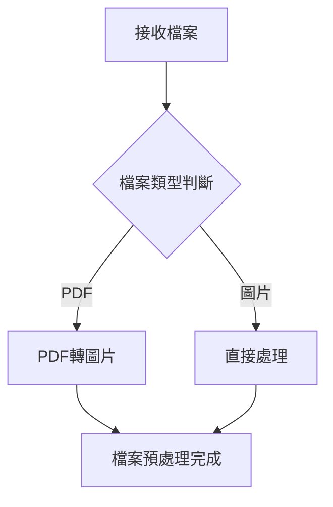
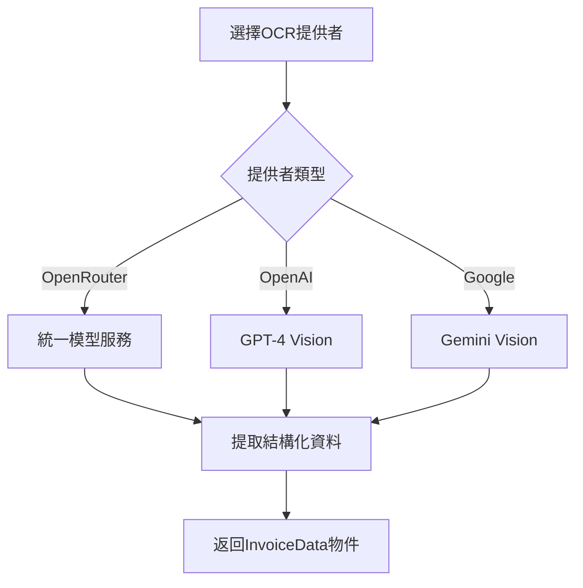
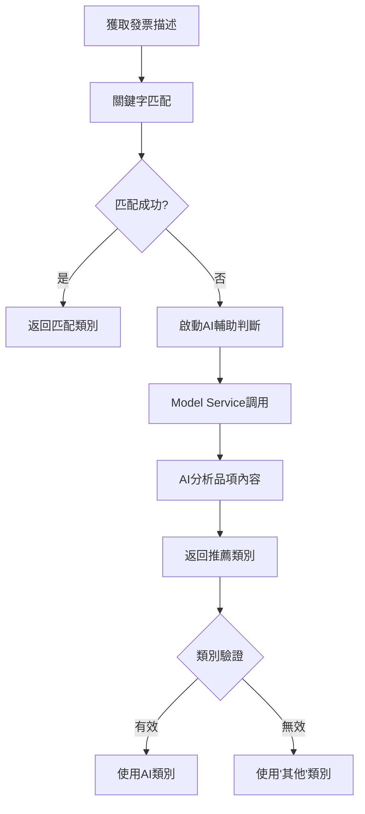
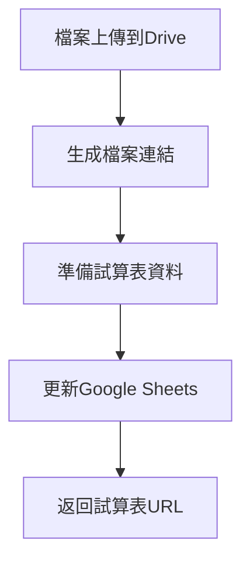

# Invoice Service 發票處理服務流程介紹

## 📋 概述

Invoice Service 是一個智能發票處理系統，整合了 OCR 技術、AI 分類和雲端儲存，專門用於自動化處理發票圖片或 PDF 檔案，提取關鍵資訊並儲存到 Google 試算表。

## 🏗️ 系統架構

### 核心組件

```
invoice_service/
├── main.py                    # 主處理器 (InvoiceProcessor)
├── config/
│   └── settings.py           # 環境設定與配置參數
├── services/
│   ├── ocr_service.py        # OCR 服務管理
│   ├── ocr_providers.py      # 多平台 OCR 提供者
│   ├── drive_service.py      # Google Drive 檔案管理
│   └── spreadsheet_service.py # Google 試算表操作
└── utils/
    └── file_utils.py         # 檔案處理工具
```

### 依賴服務

- **Model Service**: 統一的 AI 模型調用服務
- **Google Drive API**: 檔案上傳與儲存
- **Google Sheets API**: 試算表資料操作
- **多平台 OCR**: OpenAI Vision、Google Gemini、OpenRouter

## 🔄 完整處理流程

### 1. 檔案接收與預處理



**處理邏輯：**
- 支援格式：PDF、JPG、PNG、GIF、BMP
- PDF 自動轉換為高解析度圖片 (預設 300 DPI)
- 檔案驗證與錯誤處理

### 2. OCR 文字辨識



**辨識欄位：**
- `seller_id`: 賣方統一編號 (8位數)
- `invoice_number`: 發票號碼 (格式: AB-12345678)
- `invoice_date`: 發票日期 (YYYY-MM-DD)
- `account`: 總計金額 (整數)
- `invoice_type`: 發票格式 (21/25)
- `invoice_description`: 品項描述

### 3. 智能分類系統



**17種支出類別：**
- 餐食、雜支用品、公司設備、存款
- 房租、薪資、網路、分攤款項
- 收入_其他方案、車費、利息、資訊人力服務
- 健保費、勞保費、勞退金、行政費用、其他

### 4. 收支判斷機制

```python
def define_transaction_type(ocr_output: InvoiceData) -> str:
    if ocr_output.seller_id == COMPANY_NO:
        return '收入'  # 公司開立給客戶
    else:
        return '支出'  # 外部廠商開立給公司
```

### 5. 雲端儲存流程



**儲存架構：**
- Google Drive: 原始發票檔案
- Google Sheets: 結構化發票資料
- 自動產生檔案連結供查閱

## 📊 資料流向圖


## 🔧 設定參數詳解

### 環境變數配置

```bash
# OCR 服務設定
OCR_PROVIDER=google                    # 選擇提供者: google/openai/openrouter
OPENAI_API_KEY=sk-xxx                 # OpenAI API 金鑰
GOOGLE_API_KEY=xxx                    # Google API 金鑰
MODEL_NAME=gpt-4o                     # OpenAI 模型名稱
GOOGLE_MODEL_NAME=gemini-2.5-flash    # Google 模型名稱
TEMPERATURE=0.2                       # AI 回應溫度

# Google 服務設定
FOLDER_ID=1ABC...XYZ                  # Drive 資料夾 ID
SPREADSHEET_NAME=發票記錄             # 試算表名稱/ID
WORKSHEET_NAME=工作表1                # 工作表名稱
GOOGLE_APPLICATION_CREDENTIALS=path/to/creds.json

# 公司資訊
COMPANYNO=00053874                    # 公司統一編號
PDF_DPI=300                          # PDF 轉圖片解析度
```

## 📈 效能與監控

### 處理效能指標

- **OCR 處理時間**: 平均 3-8 秒/張
- **分類準確度**: 關鍵字匹配 >95%，AI輔助 >90%
- **檔案上傳**: 支援最大 10MB
- **並發處理**: 支援多使用者同時操作

### 錯誤處理機制

```python
try:
    result, usage = await processor.process_invoice_from_data(file_data, media_type)
except Exception as e:
    logger.error(f"發票處理失敗: {e}")
    # 回傳錯誤訊息給使用者
    return error_response
```

## 🚀 使用方式

### 1. 透過 LINE Bot 使用

```
使用者上傳發票圖片 → 自動處理 → 返回辨識結果
```

### 2. 命令列直接呼叫

```bash
python services/invoice_service/main.py "/path/to/invoice.pdf"
```

### 3. 程式化呼叫

```python
processor = InvoiceProcessor()
result, usage = await processor.process_invoice_from_data(file_data, media_type)
```

## 🔍 維運最佳實務

### 1. 日常監控重點

- **API 配額使用量**: OpenAI/Google 每日調用次數
- **處理成功率**: 監控 OCR 辨識失敗率
- **回應時間**: 平均處理時長
- **儲存空間**: Drive 容量使用情況

### 2. 常見問題排除

**OCR 辨識失敗：**
```bash
# 檢查 API 金鑰
echo $OPENAI_API_KEY
echo $GOOGLE_API_KEY

# 檢查模型服務狀態
python -c "from services.model_service import model_manager; print('OK')"
```

**檔案上傳失敗：**
```bash
# 檢查 Google 憑證
python -c "import gspread; gc = gspread.service_account(); print('Google Auth OK')"

# 檢查資料夾權限
python -c "from services.invoice_service.services.drive_service import DriveService; ds = DriveService(); print('Drive OK')"
```

### 3. 效能優化建議

**提升處理速度：**
- 使用較快的模型 (如 gemini-2.5-flash)
- 調整圖片解析度 (降低 PDF_DPI)
- 啟用並行處理多個檔案

**提高辨識準確度：**
- 定期更新分類關鍵字
- 調整 OCR 系統提示詞
- 收集失敗案例進行模型微調

**降低成本：**
- 優先使用免費模型配額
- 設置 API 使用上限
- 實施檔案大小限制

## 🔄 版本升級指南

### 架構擴展方向

1. **多語言支援**: 增加英文、日文發票辨識
2. **批次處理**: 支援一次處理多個檔案
3. **自動分類學習**: 基於歷史資料改善分類
4. **API 介面**: 提供 REST API 供其他服務調用
5. **資料匯出**: 支援 Excel、CSV 格式匯出

### 程式碼維護要點

- 模組化設計：各服務獨立可測試
- 設定外部化：所有參數透過環境變數控制
- 錯誤處理：完整的異常捕獲與日誌記錄
- 非同步處理：支援高併發場景
- 可擴展性：容易新增其他 OCR 提供者

---

## 📞 技術支援

如需進一步協助或有優化建議，請參考：
- 系統日誌：`logs/line_bot_simple_client.log`
- 設定檔案：`services/invoice_service/config/settings.py`
- 測試腳本：`scripts/test_invoice_ocr.py`