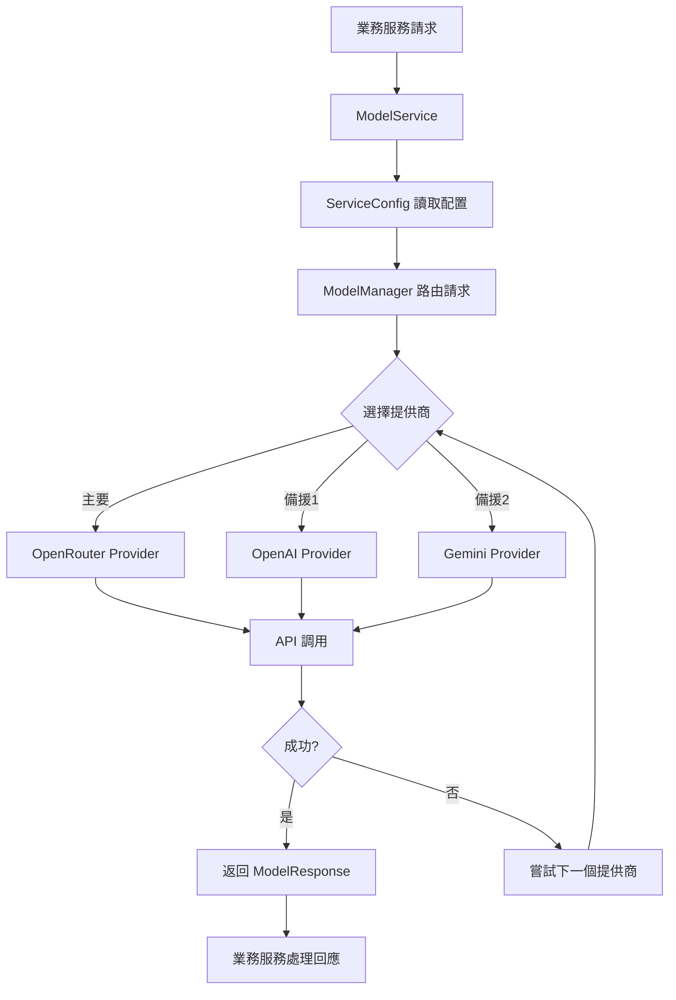

# Model Service 統一架構文檔

## 概述

Model Service 是 Goyo AI Helper 系統的核心 AI 服務層，提供統一的語言模型調用接口。它支援多個 AI 提供商（OpenRouter、OpenAI、Gemini），並為所有業務服務（QA 服務、財務分析、發票 OCR）提供一致的 AI 能力。

## 🎯 設計目標

- **統一接口**：所有 AI 服務使用相同的調用方式
- **多提供商支援**：OpenRouter、OpenAI、Gemini 自動切換
- **環境變數配置**：靈活的模型和參數設定
- **備援機制**：自動 fallback 到可用的提供商
- **依賴注入**：消除全局狀態，提升可測試性

## 🏗 架構概覽

```
┌─────────────────────────────────────────────────────────────┐
│                    Goyo AI Helper System                   │
├─────────────────────────────────────────────────────────────┤
│  QA Service    │ Finance Service │ Invoice Service │ ...   │
│  (問答服務)     │  (財務分析)      │  (發票OCR)      │       │
├─────────────────────────────────────────────────────────────┤
│                    Model Service                           │
│              (統一 AI 服務調用層)                           │
├─────────────────────────────────────────────────────────────┤
│ OpenRouter │    OpenAI     │    Gemini     │  Future...   │
│ Provider   │   Provider    │   Provider    │  Providers   │
└─────────────────────────────────────────────────────────────┘
```

## 📁 文件結構

```
services/model_service/
├── __init__.py                 # 統一導出接口
├── service.py                  # 主要服務類 ModelService
├── utils_compat.py            # 向後兼容工具函數
├── core/                      # 核心組件
│   ├── config.py              # 配置管理
│   ├── manager.py             # Model Manager
│   ├── models.py              # 數據模型
│   └── fallback.py            # 備援策略
└── providers/                 # AI 提供商實現
    ├── base_clean.py          # 基礎提供商接口
    ├── openrouter_clean.py    # OpenRouter 實現
    ├── openai_clean.py        # OpenAI 實現
    └── gemini_clean.py        # Gemini 實現
```

## 🔧 核心組件

### 1. ModelService (service.py)

**主要服務類**，提供統一的 AI 調用接口：

```python
from services.model_service import create_model_service

# 創建服務實例
model_service = create_model_service()

# QA 問答
response = await model_service.qa_completion(messages)

# 財務分析
response = await model_service.finance_completion(messages)

# OCR 識別
response = await model_service.ocr_completion(messages, images)
```

### 2. ModelManager (core/manager.py)

**提供商管理器**，負責：
- 註冊和管理多個 AI 提供商
- 執行請求路由和備援切換
- 統計使用量和健康檢查

### 3. 提供商系統 (providers/)

每個提供商實現統一的接口：

```python
class ModelProvider:
    async def chat_completion(self, messages, model, temperature, max_tokens)
    async def vision_completion(self, messages, images, model)
    async def close(self)
```

### 4. 配置系統 (core/config.py)

**分層配置管理**：
- 服務級配置 (QA、Finance、OCR)
- 提供商配置 (API keys、URLs)
- 備援配置鏈

## 🔌 服務整合關係

### QA 服務整合

**位置**: `services/qa_service/`

**整合方式**: QA 服務使用自己的 provider 系統，但也可配置使用 model_service

```python
# QA 服務配置
QA_SERVICE_MODEL="x-ai/grok-4-fast:free"
QA_SERVICE_TEMPERATURE="0.4"
QA_SERVICE_MAX_TOKENS="4096"
```

**特色功能**:
- 向量化文檔檢索 (ChromaDB)
- 智能問題分類 (簡單/複雜)
- 會話記憶管理
- 快速回應路徑

### 財務分析服務整合

**位置**: `services/finance_analysis_service/`

**整合方式**: **完全使用 model_service**

```python
# 財務分析服務 (core/ai_analyzer.py)
class AIAnalyzer:
    def __init__(self):
        self.model_service = create_model_service()

    async def answer(self, question, metrics, question_type):
        messages = [{"role": "user", "content": prompt}]
        response = await self.model_service.finance_completion(messages)
        return response.content
```

**環境變數配置**:
```bash
FINANCE_SERVICE_MODEL="x-ai/grok-4-fast:free"
FINANCE_SERVICE_TEMPERATURE="0.3"
FINANCE_SERVICE_MAX_TOKENS="8192"
```

### 發票服務整合

**位置**: `services/invoice_service/`

**整合方式**: **完全使用 model_service**

```python
# 1. 類別判斷 (main.py)
class InvoiceProcessor:
    def __init__(self):
        self.model_service = create_model_service()

    async def determine_category(self, invoice_description):
        response = await self.model_service.qa_completion(messages)

# 2. OCR 處理 (services/ocr_providers.py)
response = await ocr_completion(
    messages=messages,
    images=[base64_image],
    temperature=temperature
)
```

**環境變數配置**:
```bash
OCR_SERVICE_MODEL="gemini-2.5-flash"
OCR_SERVICE_TEMPERATURE="0.1"
OCR_SERVICE_MAX_TOKENS="2048"
```

## ⚙️ 環境變數配置

### 服務級配置

```bash
# === QA 服務 ===
QA_SERVICE_MODEL="x-ai/grok-4-fast:free"
QA_SERVICE_TEMPERATURE="0.4"
QA_SERVICE_MAX_TOKENS="4096"

# === 財務分析服務 ===
FINANCE_SERVICE_MODEL="x-ai/grok-4-fast:free"
FINANCE_SERVICE_TEMPERATURE="0.3"
FINANCE_SERVICE_MAX_TOKENS="8192"

# === 發票 OCR 服務 ===
OCR_SERVICE_MODEL="gemini-2.5-flash"
OCR_SERVICE_TEMPERATURE="0.1"
OCR_SERVICE_MAX_TOKENS="2048"
```

### 提供商配置

```bash
# === OpenRouter ===
OPENROUTER_API_KEY="your_key_here"
OPENROUTER_BASE_URL="https://openrouter.ai/api/v1"
OPENROUTER_APP_NAME="Goyo Finance Assistant"

# === OpenAI ===
OPENAI_API_KEY="your_key_here"
OPENAI_BASE_URL="https://api.openai.com/v1"

# === Gemini ===
GOOGLE_API_KEY="your_key_here"
GOOGLE_MODEL_NAME="models/gemini-2.5-flash"
```

## 🔄 備援機制

Model Service 支援自動 fallback：

```python
# 服務配置的備援鏈
QA: [
    OpenRouter("x-ai/grok-4-fast:free"),
    OpenAI("gpt-4"),
    Gemini("gemini-2.0-flash-exp")
]

Finance: [
    OpenRouter("x-ai/grok-4-fast:free"),
    OpenAI("gpt-4"),
    Gemini("gemini-2.0-flash-exp")
]

OCR: [
    Gemini("gemini-2.5-flash"),
    OpenAI("gpt-4o"),
    OpenRouter("google/gemini-2.0-flash-exp:free")
]
```

## 📊 使用流程圖



## 🎯 服務類型對應

| 服務類型 | 調用方法 | 主要用途 | 預設模型 |
|---------|---------|---------|---------|
| **QA** | `qa_completion()` | 問答、諮詢 | x-ai/grok-4-fast:free |
| **Finance** | `finance_completion()` | 財務分析 | x-ai/grok-4-fast:free |
| **OCR** | `ocr_completion()` | 圖像識別 | gemini-2.5-flash |

## 🔧 開發指南

### 添加新的業務服務

1. **創建服務類**:
```python
from services.model_service import create_model_service

class MyNewService:
    def __init__(self):
        self.model_service = create_model_service()

    async def process(self, data):
        messages = [{"role": "user", "content": data}]
        response = await self.model_service.qa_completion(messages)
        return response.content

    async def close(self):
        await self.model_service.close()
```

2. **添加環境變數**:
```bash
MY_SERVICE_MODEL="preferred_model"
MY_SERVICE_TEMPERATURE="0.5"
```

3. **更新配置** (如需要新的服務類型):
```python
# core/config.py
class ServiceType(Enum):
    MY_NEW_SERVICE = "my_service"

_DEFAULT_CONFIGS = {
    ServiceType.MY_NEW_SERVICE: ModelConfig(...)
}
```

### 添加新的 AI 提供商

1. **實現提供商類**:
```python
# providers/my_provider_clean.py
class CleanMyProvider(ModelProvider):
    async def chat_completion(self, messages, model, **kwargs):
        # 實現 API 調用
        pass
```

2. **註冊到管理器**:
```python
# core/manager.py
def create_default_manager():
    # 註冊新提供商
    manager.register_provider("my_provider", CleanMyProvider(...))
```

## 📈 監控和日誌

Model Service 提供詳細的日誌記錄：

```
✅ OpenRouter provider initialized successfully
✅ OpenAI provider initialized
✅ Gemini provider initialized
✅ 發票處理服務初始化成功
✅ SimpleFinanceService 初始化成功
✅ 財務分析服務初始化成功
```

## 🔍 故障排除

### 常見問題

1. **提供商初始化失敗**
   - 檢查 API key 是否正確設定
   - 確認網路連接正常

2. **模型回應格式錯誤**
   - 檢查 `extract_text_content()` 的相容性
   - 確認 `ModelResponse` 對象結構

3. **備援機制未生效**
   - 檢查 fallback 配置鏈
   - 確認錯誤類型是否觸發備援

### 調試技巧

```python
# 啟用詳細日誌
import logging
logging.getLogger('services.model_service').setLevel(logging.DEBUG)

# 檢查提供商狀態
stats = model_service.get_stats()
print(stats)

# 手動健康檢查
health = await model_service.health_check()
print(health)
```

## 🚀 未來擴展

Model Service 架構支援輕鬆擴展：

- **新的 AI 提供商**: Claude、Llama、本地模型
- **新的服務類型**: 翻譯、摘要、代碼生成
- **高級功能**: 請求緩存、負載均衡、成本追蹤
- **企業功能**: 審計日誌、權限控制、配額管理

---

*此文檔隨 Model Service 架構更新而持續維護*